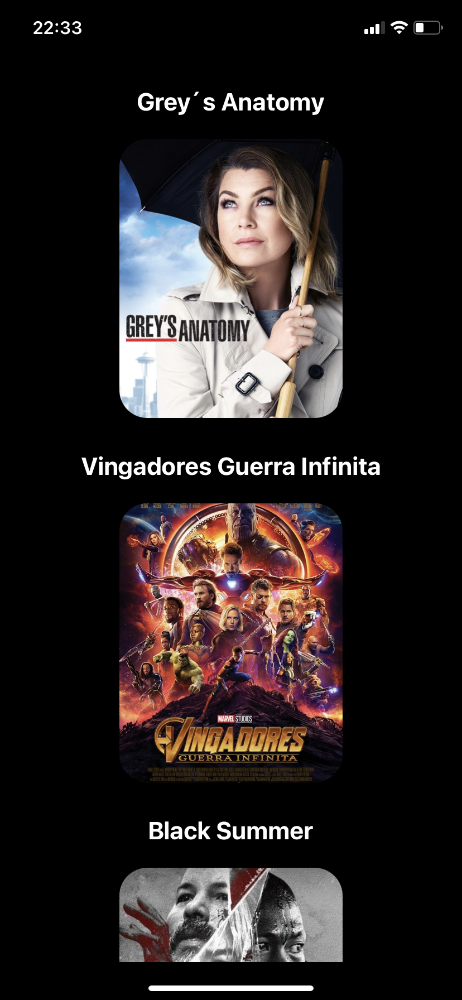

# Catalogo de Filmes

> Backend e Mobile simples, utilizando NodeJs e React-Native.
<h4>Construído com base no video do canal "Stack Mobile", disponivel no YouTube.</h4>

<h2>Esboço direto do celular: </h2>

<h3 align="center">Pagina Inicial</h3>
<h1 align="center">
   
</h1>

<h3 align="center">Scroll Pagina Inicial</h3>
<h1 align="center">
   
</h1>
